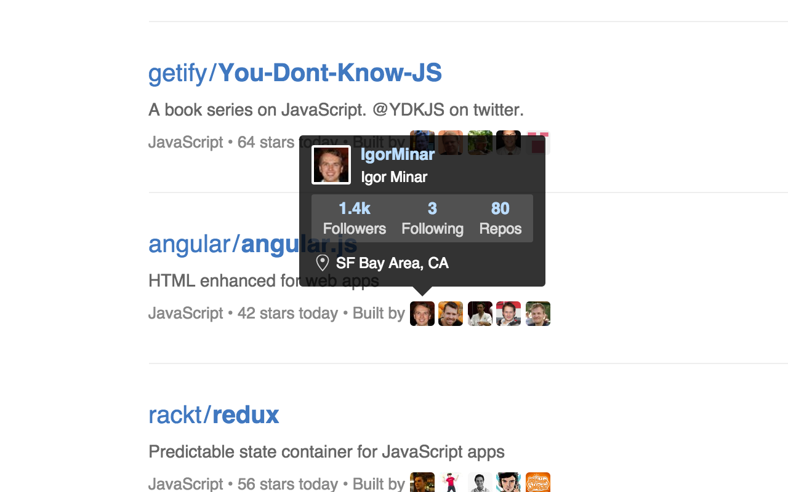
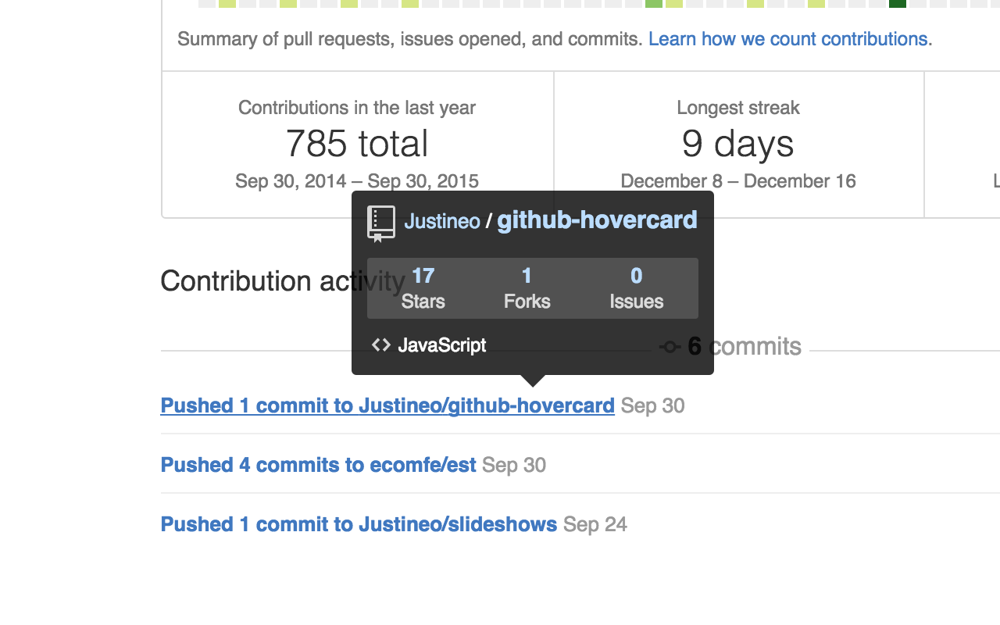
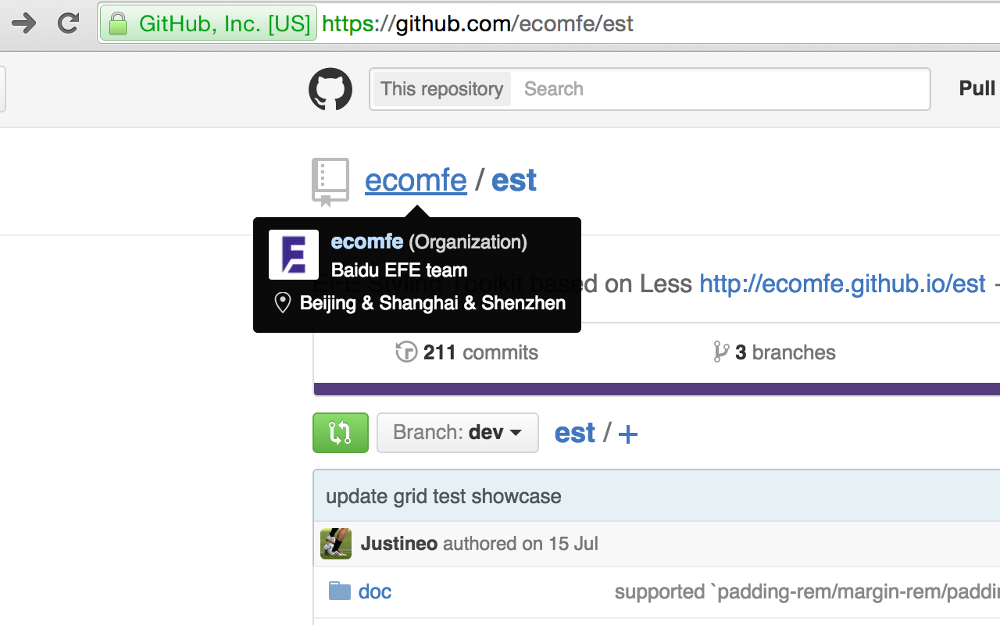
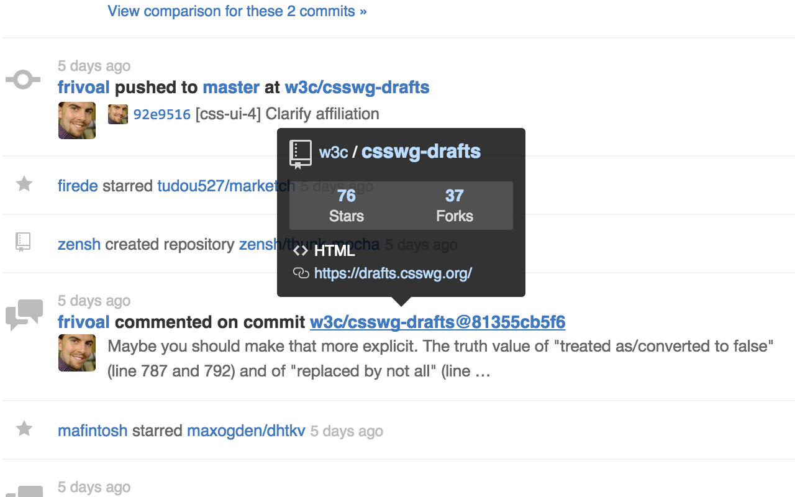
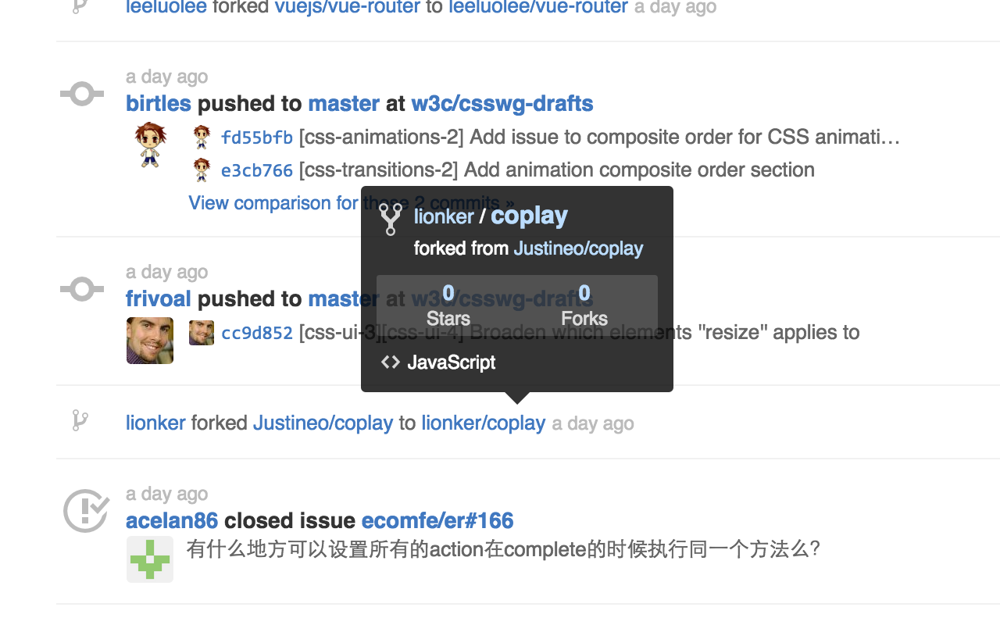
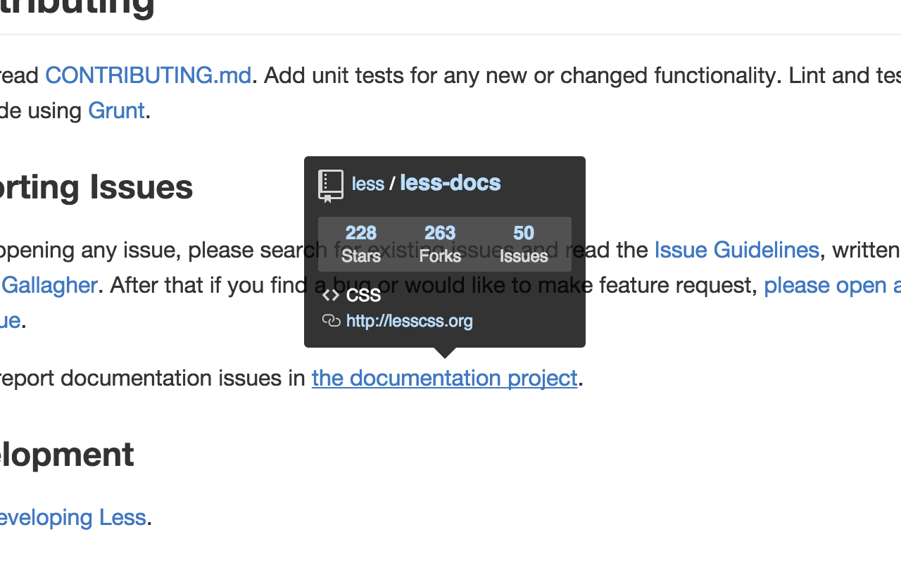
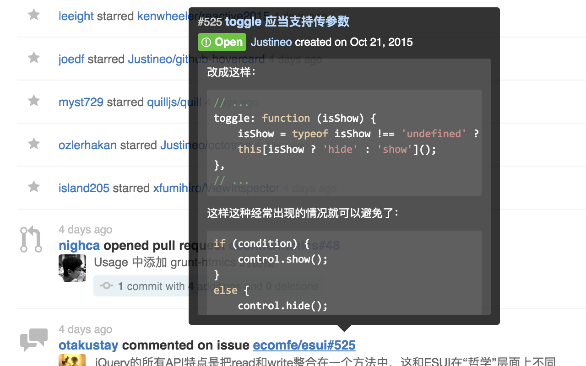

# GitHub Hovercard

Neat hovercards for GitHub.

## Installation

### Published versions

* [Chrome extension](https://chrome.google.com/webstore/detail/github-hovercard/mmoahbbnojgkclgceahhakhnccimnplk)
* [Firefox add-on](https://addons.mozilla.org/en-US/firefox/addon/github-hovercard/)
* [Opera extension](https://addons.opera.com/extensions/details/github-hovercard/)
* [Userscript](https://justineo.github.io/github-hovercard/userscript/dist/github-hovercard.user.js)

### Manual installation

* [Edge extension](https://github.com/Justineo/github-hovercard/raw/master/extensions/packed/github-hovercard.edge.zip)

  See [Adding and removing extensions for Microsoft Edge](https://docs.microsoft.com/en-us/microsoft-edge/extensions/guides/adding-and-removing-extensions).

* [Safari extension](https://minhaskamal.github.io/DownGit/#/home?url=https://github.com/Justineo/github-hovercard/tree/master/extensions/github-hovercard.safariextension)

  See [Using Extension Builder](https://developer.apple.com/library/content/documentation/Tools/Conceptual/SafariExtensionGuide/UsingExtensionBuilder/UsingExtensionBuilder.html#//apple_ref/doc/uid/TP40009977-CH2-SW10) to learn how to activate the Extension Builder. And then:

  1. Use “Add Extension” instead of “Create Extension”.
  2. Choose the downloaded directory.
  3. Click “install” to load the extension.

## FAQ

* Why and how should I bind my access token and which scopes should I allow?

    GitHub limits unauthenticated API requests to 60 per hour but after binding your access token you will be able to enjoy the rate limit of **5,000** requests per hour. 
    
    **Triple click** on any hovercard and the access token form will pop out.

    You should at lease add permission for `public_repo` to enable star/unstar, and `user:follow` to enable follow/unfollow.

* How can I make the follow/unfollow button work?

    First you need to provide an access token with adequate scopes.

* Why Chrome warns me the extension might read my browser history?

    It's because GitHub Hovercard uses `webNavigation` module to dynamically inject content scripts (to support GitHub Enterprise). See [#34](https://github.com/Justineo/github-hovercard/issues/34). GitHub Hovercard won't track or record any of these private data.

* Why can GitHub Hovercard's demo page find out I have installed the extension or not?

    In Chrome/Opera it's allowed to get this information through the API while in Firefox the extension will add a special attribute (`data-github-hovercard`) to the page's `body` element so that the demo page can find out if the user has installed GitHub Hovercard. It's all about user experience and the extension itself won't track or record these data.

* Why access token doesn't work?

    Now GitHub Hovercard is saving user's private access token into `localStorage`. `localStorage` has a limit of 5MB and the problem might be other extensions have consumed too much storage that GitHub Hovercard failed to save access tokens.

## Options

For browser extension versions, GitHub Hovercard provide following options:

* Domain

    Use this option to set custom domains for your GitHub Enterprise service. Note that you don't need to set `github.com` because it's always included. You may be asked to grant additional permissions for those domains.

* Delay

    If you don't want the hovercards to pop up instantly, you may set a delay before they try to retrieve data and appear.

* Readme
    
    You may disable readme content for repo cards if you don't need it.

* Show self

    You may choose if you want to show user hovercard for yourself.

## Screenshots

## Known issues

For unauthenticated requests, GitHub API has a fairly low request limit.

~~In later versions I might introduce access tokens to increase this limit.~~

~~Working on it.~~

Authentication is supported from v0.0.7.

## Acknowledgements

* Thank [Tooltipster](https://github.com/iamceege/tooltipster/) for the awesome tooltip component.
* Thank [jQuery](https://github.com/jquery/jquery) for basic operations.
* Thank [Mustache.js](https://github.com/janl/mustache.js) for templating.
